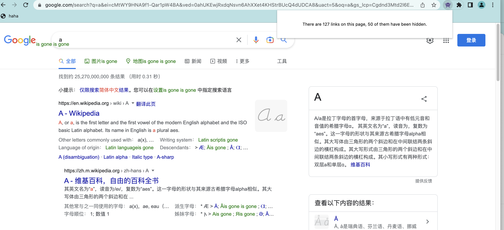

## Hide some links

This extension will disable a random amount of links on the current webpage. It'll display the total number of links and how many of them are disabled. It's surprising to find out there can be so many links on one page.