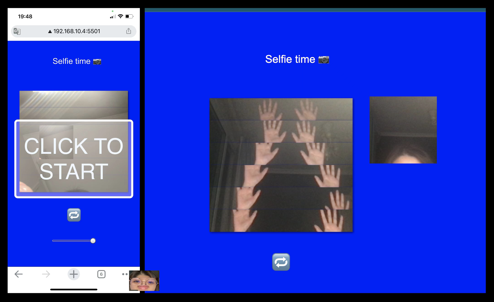

# selfie cam?

## Description
This project consist of 6 independent canvas that draw from user's camera to recreate a complete image. Each canvas will automatically freeze in sequence after 3 seconds when viewed on a computer, while on phone, it freezes when motion is detected. Ratio is adjustable on phone for variations.
## Challenges, solutions, compromises and shortcomings
The most common problem I encountered was finding the right location and sequence for code: whether a variable should be global or something should go inside the function.This kind of problem is hard to detect because there's no error message. The solution was to experiment with different locations and to ask the professor ;) 
Another challenge was I sometimes got confused between two devices: I viewed the website in phone mode on the computer and yet forgot Devicemotion didn't work on a computer(same situation as with the Request Desktop Site function on the phone). Spent a long time trying to find out what went wrong 😅. It reminded me to be more careful when coding. 
The initial thought was to add filters and loop the videos instead of freezing them as images, but I didn't manage to achieve that. The project might still look too simple, and the sequence of image-freezing and the motion-controlling part doesn't work very accurately on the phone, which I think is the part that needs to be improved the most.

